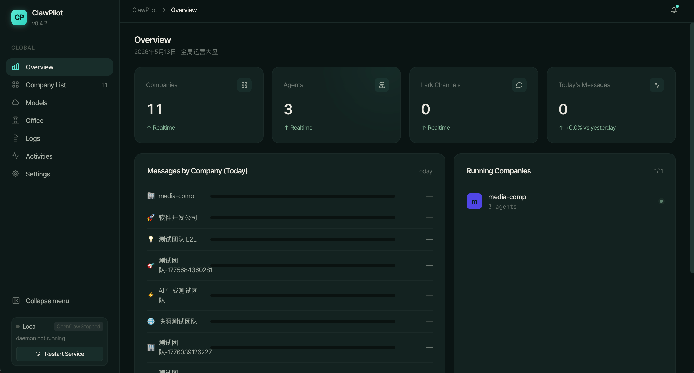
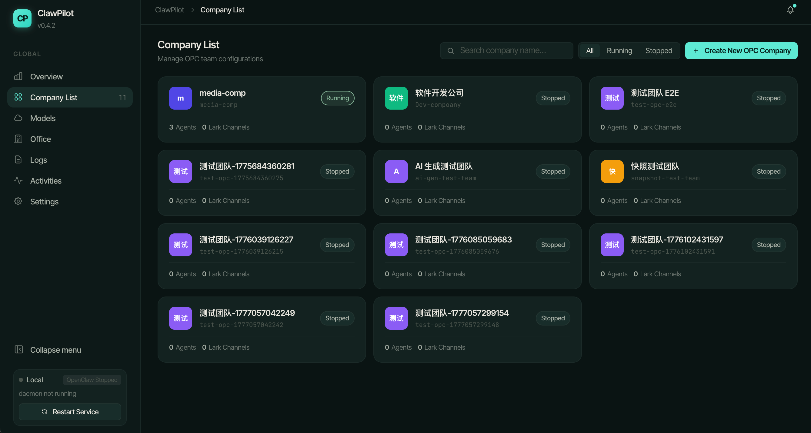
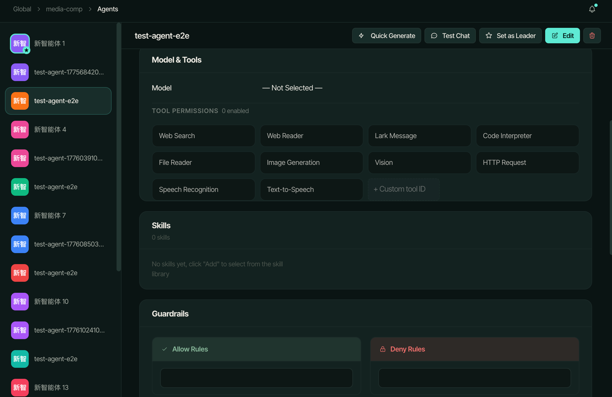
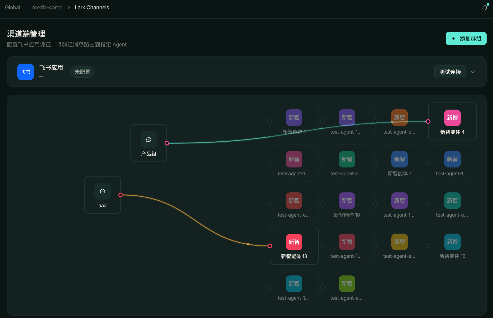
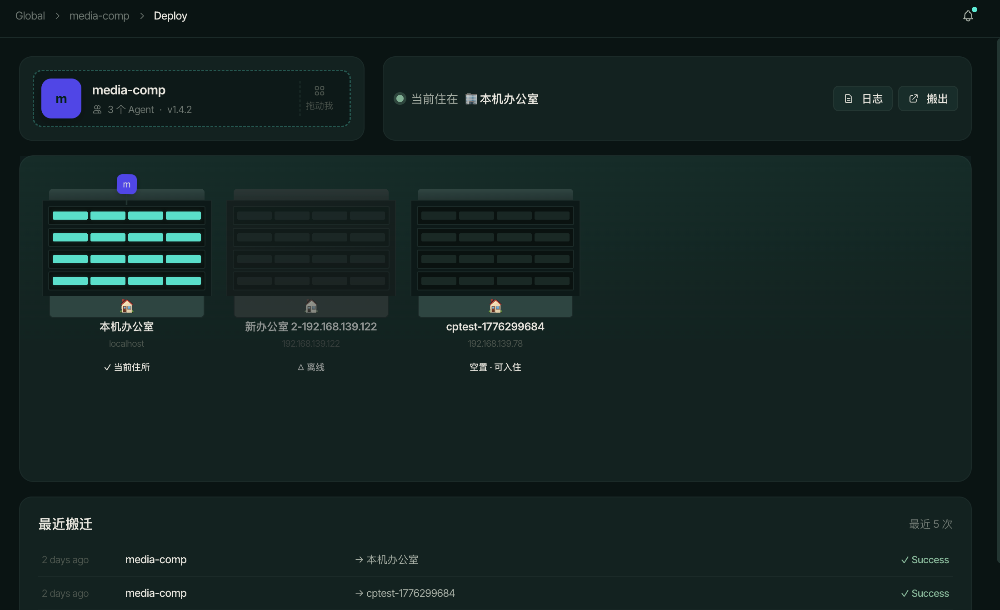
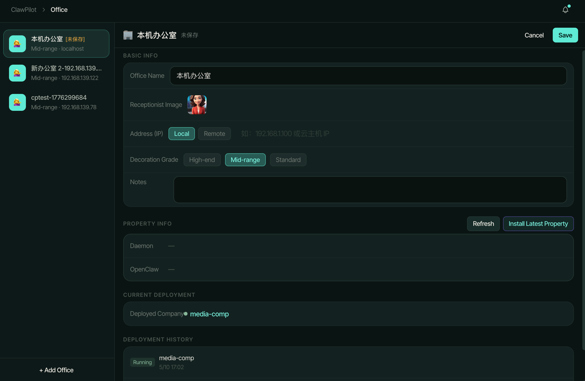
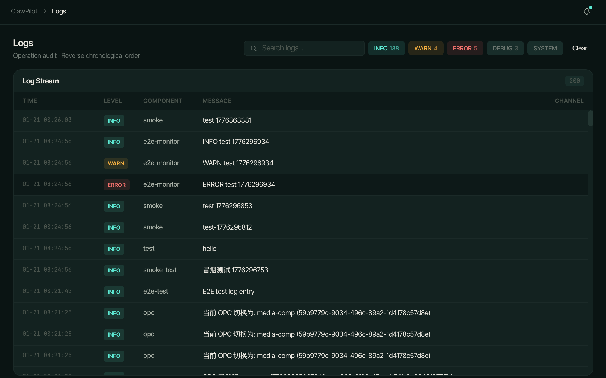
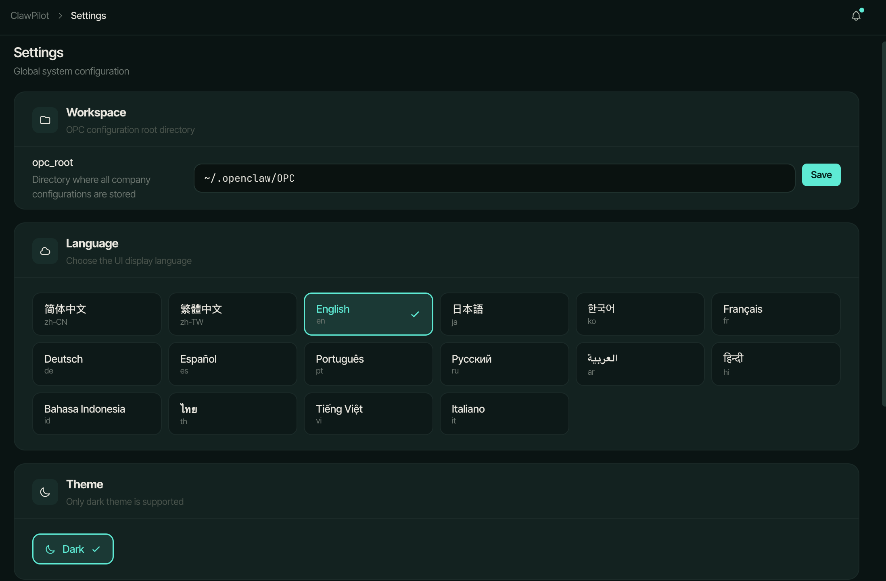

# ClawPilot

Visual desktop application for managing OpenClaw team configurations (OPC). Create, manage, and one-click deploy agent teams, channels, models, tools, and skills.


## Screenshots

| Overview | Company List | Agent Config | Channel Binding |
|---|---|---|---|
|  |  |  |  |

| Deploy | Office | Logs | Settings |
|---|---|---|---|
|  |  |  |  |

## Tech Stack

| Layer | Technology |
|---|---|
| **Desktop framework** | [Tauri 2](https://v2.tauri.app/) — native desktop apps with minimal bundle size |
| **Backend** | Rust — [axum](https://github.com/tokio-rx/axum) HTTP server, [tokio](https://tokio.rs/) async runtime, [rusqlite](https://github.com/rusqlite/rusqlite) SQLite driver, [aes-gcm](https://github.com/RustCrypto/AEADs) encryption |
| **Frontend** | React 18 + TypeScript — [Vite](https://vite.dev/) build, [React Router](https://reactrouter.com/) routing, [i18next](https://www.i18next.com/) internationalization |
| **Database** | SQLite 3 — embedded, zero-config, single-file storage |
| **Daemon** | Standalone Rust service (axum + tokio) for background OPC scheduling and deployment |
| **Testing** | Vitest (unit), Playwright (E2E) |
| **CI/CD** | GitHub Actions — builds `.dmg` (macOS Apple Silicon), daemon binary, publishes to GitHub Releases |
| **Package manager** | pnpm |

## Architecture

```
┌──────────────────────────────────────────────────────┐
│                    ClawPilot Desktop                  │
│  ┌─────────────────────┐    ┌──────────────────────┐ │
│  │   React Frontend    │◄──►│  Embedded axum HTTP  │ │
│  │   (Vite + TSX)      │ HTTP│  Server (Rust)       │ │
│  └─────────────────────┘    └──────────┬───────────┘ │
│                                       │              │
│                              ┌────────▼──────────┐   │
│                              │   SQLite Database │   │
│                              │   ~/.clawpilot/   │   │
│                              └───────────────────┘   │
└──────────────────────────────────────────────────────┘
          ▲
          │  one-click deploy
          ▼
┌──────────────────────────────────────────────────────┐
│              ClawPilot Daemon (port 16668)            │
│  Background service for OPC scheduling & deployment   │
│  ┌──────────┐  ┌──────────┐  ┌──────────────────┐    │
│  │  Scheduler│  │  WebSocket│  │  HTTP API (axum) │    │
│  └──────────┘  └──────────┘  └──────────────────┘    │
└──────────────────────────────────────────────────────┘
```

## Features

- **OPC Management** — Create and manage OpenClaw team configurations with multiple agents
- **Agent Configuration** — Per-agent settings, SOUL.md / AGENTS.md document management
- **Model Providers** — OpenAI, Anthropic, Alibaba, VolcEngine, MiniMax and more
- **Channel Integration** — Feishu (Lark) and other messaging platform bindings
- **Tools & Skills** — Built-in and custom tools/skills registry
- **One-Click Deploy** — Deploy OPC configurations to remote offices via SSH
- **Office Management** — Remote host provisioning, health checks, deployment tracking
- **Dark Mode** — Native macOS/Windows/Linux appearance
- **i18n** — 16 languages: ar, de, en, es, fr, hi, id, it, ja, ko, pt, ru, th, vi, zh-CN, zh-TW

## Quick Start

### Prerequisites

- **Node.js** >= 20 + **pnpm**
- **Rust** >= 1.75 (stable toolchain)
- **macOS**: Xcode Command Line Tools
- **Linux**: `libwebkit2gtk-4.1-dev`, `libappindicator3-dev`, `librsvg2-dev`, `libgtk-3-dev`

### Development

```bash
# Start all services (frontend + API server + daemon)
npm run dev
# or
bash scripts/dev.sh

# Start individual services
npm run dev:web     # Vite frontend (port 16666)
npm run dev:api     # Rust API server (port 16667)

# Seed development data
./seed-dev-env.sh
```

### Build

```bash
# Frontend only
npm run build:frontend

# Daemon binary (current platform)
npm run build:daemon

# Tauri desktop app
npm run build:tauri

# Full release (daemon + tauri for all platforms)
npm run build:release
```

### Cross-compile daemon for all platforms

```bash
make build-all
```

Outputs to `dist-release/` with versioned filenames.

### Testing

```bash
npm run test           # Unit tests (Vitest)
npm run test:coverage  # With coverage
npm run test:e2e       # E2E tests (Playwright)
```

## Project Structure

```
ClawPilot/
├── src/                    # React frontend (TypeScript)
│   ├── components/         # Reusable UI components
│   ├── pages/              # Page-level components
│   ├── hooks/              # Custom React hooks
│   ├── contexts/           # React context providers
│   ├── lib/                # API client, types, utilities
│   └── i18n/               # Translation files (16 locales)
├── src-tauri/              # Rust backend + Tauri config
│   ├── src/
│   │   ├── commands/       # Tauri command handlers
│   │   ├── services/       # Business logic layer
│   │   ├── models/         # Data structures
│   │   ├── database/       # SQLite schema and helpers
│   │   ├── http/           # axum HTTP routes
│   │   ├── utils/          # Crypto, path resolution, etc.
│   │   └── bin/            # dev-server binary
│   ├── Cargo.toml
│   └── tauri.conf.json
├── daemon/                 # Standalone Rust daemon service
│   ├── src/
│   └── Cargo.toml
├── proto/                  # Protobuf definitions (data model source of truth)
├── tests/                  # Playwright E2E tests
├── docs/                   # Development documentation
├── scripts/                # Dev scripts
└── bundle/                 # Bundled skills metadata
```

## Data Storage

All runtime data lives in `~/.clawpilot/`:

```
~/.clawpilot/
├── clawpilot.db            # Main SQLite database
├── server.key              # Encryption key for API keys
├── daemon.key              # Daemon encryption key
├── scheduler.db            # Daemon scheduler database
├── artifacts/              # Deployment artifacts
├── bin/                    # Bundled binaries (daemon)
└── logs/                   # Runtime logs
```

API keys are encrypted with AES-GCM before storage. The encryption key is stored separately in `server.key`.

## Configuration Format

OPC configurations use JSON/JSON5, compatible with OpenClaw. The `proto/` directory contains `.proto` definitions that serve as the single source of truth for all data models across TypeScript types, Rust structs, and SQLite schemas.

## CI/CD

Push a `v*` tag to trigger the build workflow:

```bash
git tag v0.2.0 && git push origin v0.2.0
```

This builds:
- `clawpilot-v0.2.0-macos-arm64.dmg` — macOS Apple Silicon desktop app
- `clawpilot-daemon-v0.2.0-macos-arm64` — macOS daemon binary

Artifacts are published to GitHub Releases. Manual builds are also supported via `workflow_dispatch`.

## License

MIT
